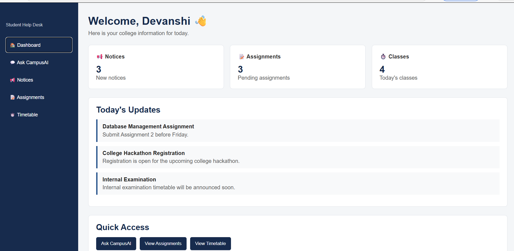

# 🎓 CampusAI - Student Help Desk

CampusAI is a simple web-based student help desk designed to keep important college information in one place.

It helps students check college notices, assignments, class timetables and get quick answers to common college-related questions.

## ✨ Features

- 🏠 Student Dashboard
- 💬 CampusAI Help Chat
- 📢 College Notices
- 🔍 Search Notices
- 📝 Assignment Tracker
- ➕ Add New Assignments
- 🗑️ Delete Assignments
- ⏱️ Class Timetable
- 📱 Responsive design
- 💾 Local Storage for assignments

## 🛠️ Technologies Used

- HTML5
- CSS3
- JavaScript
- Local Storage

## 📂 Project Structure

CampusAI/
- index.html
- style.css
- script.js
- README.md

## 🚀 How to Run

1. Download or clone this repository.
2. Open the CampusAI folder in Visual Studio Code.
3. Open `index.html` in your browser.

You can also use the Live Server extension in VS Code.

## 💡 How It Works

### 📢 Notices

Students can view important college announcements and search for specific notices.

### 📝 Assignments

Students can view pending assignments, add new assignments and delete assignments.

Assignment information can be stored using the browser's Local Storage.

### ⏱️ Timetable

Students can select a day of the week and view their scheduled classes.

### 💬 Ask CampusAI

The help chat provides quick responses to common student questions related to assignments, notices, timetable, exams and college activities.

The current version uses JavaScript-based responses as a simple working MVP.

## 📸 Project Preview

Add a screenshot of the project here.

## 🌐 Live Demo

[Click here to try CampusAI](https://devanshi-tech3158.github.io/CampusAI/)

## 🎯 Future Improvements

- Connect the chatbot with a real AI model
- Add student login and authentication
- Connect with a college database
- Add student and faculty dashboards
- Add assignment reminders
- Add notifications for important announcements
- Connect data with Firebase or Supabase

## 🎓 Project Purpose

This project was created as a practical web development project to understand how HTML, CSS and JavaScript can be combined to build a useful student-focused application.

It helped in learning:

- Frontend development
- JavaScript
- DOM manipulation
- Local Storage
- Responsive web design
- Git and GitHub
- GitHub Pages deployment

## 👩‍💻 Developed By

**Devanshi Goyal**

B.Tech CSE Student

---

⭐ If you find this project useful, feel free to star the repository!
